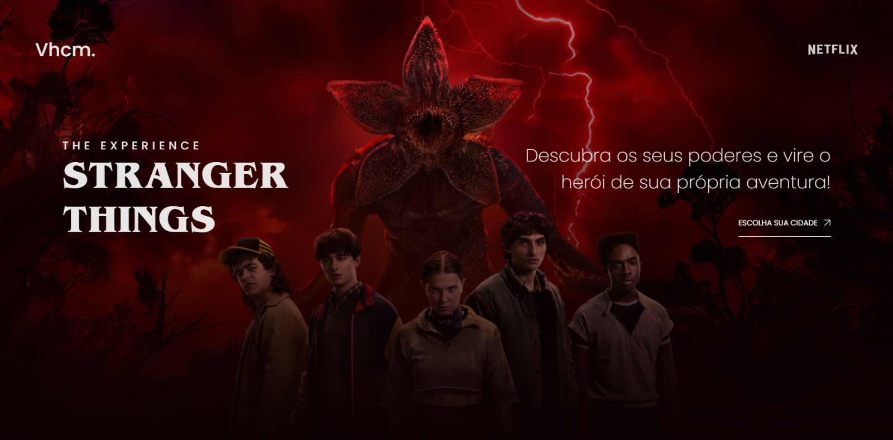
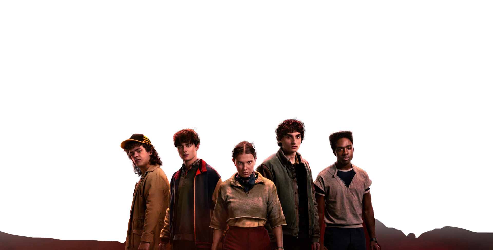

# 🚲 Stranger Things: The Experience — Workshop DevArt (2025)

---

🎬 Este repositório apresenta o projeto desenvolvido para fins de **estudo de desenvolvimento web**, focado na criação de uma interface imersiva e responsiva. O projeto foi realizado durante o workshop **DevArt Stranger Things**, sob tutoria do desenvolvedor **Gustavo Campelo**.

O site simula uma página de divulgação de uma experiência fictícia baseada na série, adaptada tanto para dispositivos móveis quanto para computadores.

---

## 💡 Sobre o Projeto

O projeto teve como tema central:

> "Desenvolvimento de uma Landing Page Imersiva e Responsiva com Animações Avançadas"

O objetivo principal foi praticar a estruturação de layouts responsivos (**Desktop First** e adaptação para Mobile) e a implementação de animações fluidas para melhorar a experiência do usuário, utilizando tecnologias nativas da web e bibliotecas de animação.

---

## 🛠 Tecnologias Utilizadas

* 1 × Estrutura semântica em **HTML5**
* 1 × Estilização avançada com **CSS3**
* 1 × Interatividade com **JavaScript**
* 1 × Biblioteca de animações **GSAP**
* 1 × Fontes personalizadas (**Stranger Things Font**)
* Design Responsivo (**Media Queries**)

---

## 📂 Estrutura do Repositório

| Arquivo/Pasta | Descrição |
| :--- | :--- |
| `index.html` | Arquivo principal com a estrutura semântica da página web |
| `styles.css` | Folha de estilos contendo o layout, cores, tipografia e responsividade |
| `script.js` | Lógica de programação e controle das animações com GSAP |
| `./imagens` | Pasta contendo os assets visuais (backgrounds, logos, personagens) |
| `./fontes` | Pasta com os arquivos de tipografia utilizados no projeto |

---

## ✅ Resultado

.
.

Acesse o projeto em: stgthings.vercel.app
---

## </> Desenvolvimento

📘 **Autor:** [Vitor Henrique Morais](https://github.com/Vhcmorais)
👨‍🏫 **Tutoria:** Gustavo Campelo (Workshop DevArt)
💻 **Contexto:** Estudos de Front-end e UI/UX

