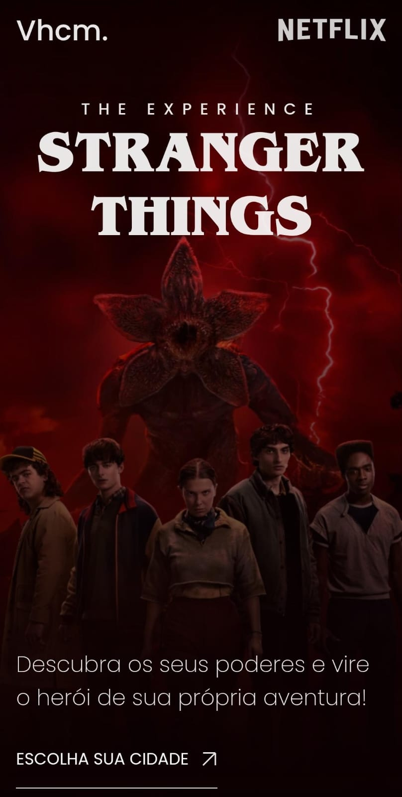

# 🚲 Stranger Things: The Experience — DevArt Workshop (2025)

🎬 This repository showcases a web development study project focused on creating an immersive and responsive user interface. The project was developed during the **DevArt Stranger Things Workshop**, under the mentorship of developer **Gustavo Campelo**.

The website simulates a promotional page for a fictional Stranger Things-inspired experience, designed to provide an engaging experience on both desktop and mobile devices.

---

## 💡 About the Project

The project was centered around the following theme:

> **Development of an Immersive and Responsive Landing Page with Advanced Animations**

The main goal was to practice building responsive layouts using a **Desktop-First** approach and adapting them for mobile devices, while implementing smooth animations to enhance the overall user experience.

---

## 🛠 Technologies Used

- HTML5
- CSS3
- JavaScript
- GSAP (GreenSock Animation Platform)
- Custom Fonts (Stranger Things Font)
- Responsive Design with Media Queries

---

## 📂 Repository Structure

| File/Folder | Description |
|------------|-------------|
| `index.html` | Main webpage structure |
| `styles.css` | Styling, typography, colors, and responsiveness |
| `script.js` | Interactivity and GSAP animations |
| `imagens/` | Visual assets such as backgrounds, logos, and characters |
| `fontes/` | Custom font files |

---

## ✅ Project Preview

### Desktop Version

### Mobile Version

---

## 🌐 Live Demo

🔗 **Visit the project:** https://stgthings.vercel.app

---

## 🎯 Learning Objectives

- Build responsive web interfaces.
- Practice modern CSS layout techniques.
- Create engaging animations with GSAP.
- Improve front-end development skills.
- Explore UI/UX design principles.

---

## 👨‍💻 Development

**Author:** [Vitor Henrique Morais](https://github.com/Vhcmorais)

**Mentorship:** Gustavo Campelo (DevArt Workshop)

**Context:** Front-End Development and UI/UX Studies

---

